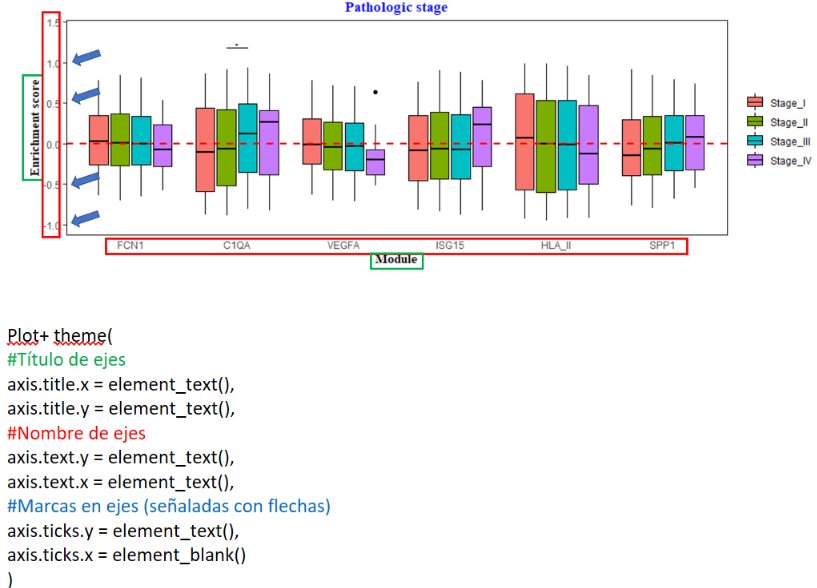

# 🔢 Vectores nombrados

En R, un **vector nombrado** te permite asignar un nombre a cada elemento del vector. Esto hace que el vector sea más legible y te permite acceder a los valores por su nombre.

```{r}
# Crear un vector normal
edades <- c(9, 8, 10)

# Agregar nombres a cada valor
names(edades) <- c("Ana", "Luis", "Sofía")

# Mostrar el vector nombrado
edades
```

También puedes crear un vector nombrado desde el inicio:

```{r}
edades <- c(Ana = 9, Luis = 8, Sofía = 10)
edades
```

## Acceder a elementos por nombre

```{r}
edades["Ana"]
edades[c("Luis", "Sofía")]
```

## Modificar elementos por nombre

```{r}
edades["Luis"] <- 9
edades
```

---

# 🧭 Factores

Los **factores** son vectores especiales que se usan para representar **categorías** (variables cualitativas), como sexo, tipo de tratamiento, o niveles educativos.

```{r}
# Vector de texto
sexo <- c("Mujer", "Hombre", "Mujer", "Mujer", "Hombre")

# Convertirlo en factor
sexo_factor <- factor(sexo)
sexo_factor
```

Esto le asigna internamente un número a cada categoría:

```{r}
as.numeric(sexo_factor)
levels(sexo_factor)
```

## Especificar niveles y su orden

Puedes controlar el orden de los niveles:

```{r}
niveles <- c("Bajo", "Medio", "Alto")
respuesta <- c("Medio", "Alto", "Bajo", "Bajo", "Alto")
respuesta_factor <- factor(respuesta, levels = niveles, ordered = TRUE)
respuesta_factor
```

## Comparaciones entre factores ordenados

```{r}
# Bajo es mas pequeño que Medio
respuesta_factor[1] < respuesta_factor[2]  # TRUE
```
---

# 🎨 Introducción a la gramática de `ggplot2`

La gramática de `ggplot2` se basa en **capas** que se agregan secuencialmente para construir una visualización. Cada capa tiene una función específica:

---

## 🧱 Capa 1: Datos y mapeo estético (`ggplot(aes())`)

- `data =`: se indica el **data frame** que contiene los datos.
- `aes()`: define las **columnas** que se usarán para los ejes y atributos estéticos.

```{r}
library(ggplot2)

# Primera capa: datos y asignación de ejes
ggplot(data = mtcars, aes(x = gear, y = mpg))
```

Aquí no se ve nada todavía porque no hemos definido el tipo de gráfico.

---

## 🖼 Capa 2: Tipo de gráfico (geom)

La siguiente capa define **cómo** se mostrarán los datos.

### Tipos comunes:

| Función        | Descripción                   |
|----------------|-------------------------------|
| `geom_col()`   | Gráfico de barras             |
| `geom_point()` | Dispersión o puntos           |
| `geom_boxplot()`| Boxplot                      |
| `geom_tile()`  | Heatmap                       |
| `geom_density()` | Densidad                    |

```{r}
# Ejemplo: gráfico de barras
ggplot(data = mtcars, aes(x = factor(gear), y = mpg)) +
  geom_col()
```

```{r}
# Ejemplo: gráfico de dispersión
ggplot(data = mtcars, aes(x = hp, y = mpg)) +
  geom_point()
```

```{r}
# Ejemplo: boxplot por número de cilindros
ggplot(data = mtcars, aes(x = factor(cyl), y = mpg)) +
  geom_boxplot()
```

---

## 🎨 Capa 3: Estética y personalización

La estética del gráfico se ajusta con `theme()`, `xlab()`, `ylab()`, `ggtitle()`, etc.

La función `theme()` en `ggplot2` permite alterar de manera específica los **elementos visuales** del gráfico.  
Una parte muy común de modificar es el **texto de los ejes**, conocido como `axis.text`.

Este texto incluye las etiquetas numéricas o categóricas que se colocan automáticamente en los ejes `x` e `y` para representar los valores correspondientes.

---

### ❌ Eliminar completamente el texto de los ejes

```{r}
library(ggplot2)

ggplot(data = mtcars, aes(x = factor(cyl), y = mpg)) +
  geom_boxplot() +
  theme(axis.text = element_blank())
```

🔎 En este caso, se usa `axis.text = element_blank()` para **eliminar por completo** las etiquetas de ambos ejes.  
Esto puede ser útil si el gráfico ya es suficientemente claro por sí solo o si queremos ahorrar espacio visual.

---

### 🎯 Modificar solo el texto del eje X

```{r}
ggplot(data = mtcars, aes(x = factor(cyl), y = mpg)) +
  geom_boxplot() +
  theme(
    axis.text.x = element_text(size = 14, face = "bold", angle = 0)
  )
```

- `axis.text.x`: se refiere **solo** al texto del eje horizontal (X).
- `size = 14`: aumenta el tamaño del texto (puedes usar también `size = rel(1.5)`).
- `face = "bold"`: cambia el estilo del texto (otras opciones: `"italic"`, `"plain"`).
- `angle = 0`: mantiene el texto horizontal.

---

### 🎯 Modificar solo el texto del eje Y

```{r}
ggplot(data = mtcars, aes(x = factor(cyl), y = mpg)) +
  geom_boxplot() +
  theme(
    axis.text.y = element_text(size = 10, face = "italic")
  )
```

- Aquí se personaliza el texto del **eje vertical (Y)**.
- Se reduce el tamaño (`size = 10`) y se cambia a cursiva (`face = "italic"`).

---

### 🧩 Nota importante:

- Puedes modificar **`axis.text.x` y `axis.text.y`** por separado o al mismo tiempo.
- Si usas `axis.text` sin `.x` o `.y`, se aplica el cambio **a ambos ejes simultáneamente**.


## 🎨 Modificando `axis.title` y `axis.ticks` con `theme()`

Además de `axis.text`, en `ggplot2` también puedes modificar:

- **`axis.title`**: los títulos de los ejes (por ejemplo, "Eje X", "Eje Y").
- **`axis.ticks`**: las pequeñas marcas que indican las posiciones de los valores en los ejes.

Estas capas pueden ayudarte a personalizar la visualización para hacerla más clara o más estética.

---

### 🖊️ Modificar el título del eje X (`axis.title.x`)

```{r}
library(ggplot2)

ggplot(data = mtcars, aes(x = factor(cyl), y = mpg)) +
  geom_boxplot() +
  theme(axis.title.x = element_text(size = 16, face = "bold", color = "blue")) +
  xlab("Número de cilindros")
```

✅ Explicación:

- `axis.title.x`: modifica **solo el título del eje X**.
- `size`: controla el tamaño del texto.
- `face`: estilo (`"bold"`, `"italic"`, etc.).
- `color`: permite definir un color.

---

### 🖊️ Modificar el título del eje Y (`axis.title.y`)

```{r}
ggplot(data = mtcars, aes(x = factor(cyl), y = mpg)) +
  geom_boxplot() +
  theme(axis.title.y = element_text(size = rel(1.5), color = "darkgreen")) +
  ylab("Millas por galón")
```

✅ Aquí usamos `rel(1.5)` para escalar el tamaño y un color específico.

---

### ❌ Eliminar los títulos de ambos ejes

```{r}
ggplot(data = mtcars, aes(x = factor(cyl), y = mpg)) +
  geom_boxplot() +
  theme(
    axis.title.x = element_blank(),
    axis.title.y = element_blank()
  )
```

🔎 Útil cuando los títulos no aportan información adicional.

---

### 🎯 Eliminar las marcas (`axis.ticks`)

```{r}
ggplot(data = mtcars, aes(x = factor(cyl), y = mpg)) +
  geom_boxplot() +
  theme(axis.ticks = element_blank())
```

✅ Esto elimina todas las pequeñas líneas (ticks) de ambos ejes.

---

### 🔧 Modificar solo las marcas del eje X o Y

```{r}
# Solo eje X
ggplot(data = mtcars, aes(x = factor(cyl), y = mpg)) +
  geom_boxplot() +
  theme(axis.ticks.x = element_blank())

# Solo eje Y
ggplot(data = mtcars, aes(x = factor(cyl), y = mpg)) +
  geom_boxplot() +
  theme(axis.ticks.y = element_blank())
```

---

## 📌 Resumen: Personalización de ejes con `theme()` en `ggplot2`

En esta sección exploramos cómo personalizar los elementos visuales de un gráfico utilizando la función `theme()` de `ggplot2`. Esta herramienta es fundamental para adaptar tus visualizaciones a distintas audiencias y hacerlas más claras, impactantes y profesionales.

### ✅ Elementos que puedes modificar:

1. **Títulos de ejes (`axis.title`)**  
   - Se refiere a los títulos que describen lo que representa cada eje.  
   - Puedes modificar su tamaño, color, estilo (`"bold"`, `"italic"`) y alineación.  
   - Se puede aplicar por separado con `axis.title.x` o `axis.title.y`.

2. **Texto de ejes (`axis.text`)**  
   - Representa los valores o categorías que se muestran en los ejes.  
   - Puedes personalizar su tamaño, orientación (con `angle`), estilo de letra y visibilidad.  
   - Se usa comúnmente para mejorar la legibilidad o resaltar grupos importantes.  
   - Ejemplos útiles incluyen rotar los textos del eje X o hacer más pequeño el texto del eje Y si hay muchas marcas.

3. **Marcas en los ejes (`axis.ticks`)**  
   - Son las pequeñas líneas que indican la ubicación de los valores en los ejes.  
   - Puedes eliminarlas con `element_blank()` si no son necesarias o recargan el diseño.  
   - También puedes desactivarlas individualmente (`axis.ticks.x`, `axis.ticks.y`).

---

### 🎯 Buenas prácticas:

- Elige los elementos a modificar según la necesidad del gráfico: claridad, espacio o énfasis.
- Usa `element_text()` para aplicar estilos personalizados.
- Usa `element_blank()` cuando quieras eliminar visualmente elementos que no aporten información.
- Puedes aplicar estilos globales o dirigirte a un eje en específico usando `.x` o `.y`.

Este nivel de control permite adaptar cada gráfico a su propósito comunicativo, facilitando la interpretación de los datos por parte del lector.


## Ilustración del uso de `theme()` en ggplot2

La siguiente imagen muestra un gráfico con **anotaciones visuales** que ayudan a identificar claramente qué elementos pueden modificarse usando `theme()`.

- 🔵 En azul: las marcas o "ticks" (`axis.ticks`)
- 🔴 En rojo: el texto de los ejes (`axis.text`)
- 🟢 En verde: los títulos de los ejes (`axis.title`)
- También se muestra cómo se estructuran las capas del gráfico y su sintaxis básica

